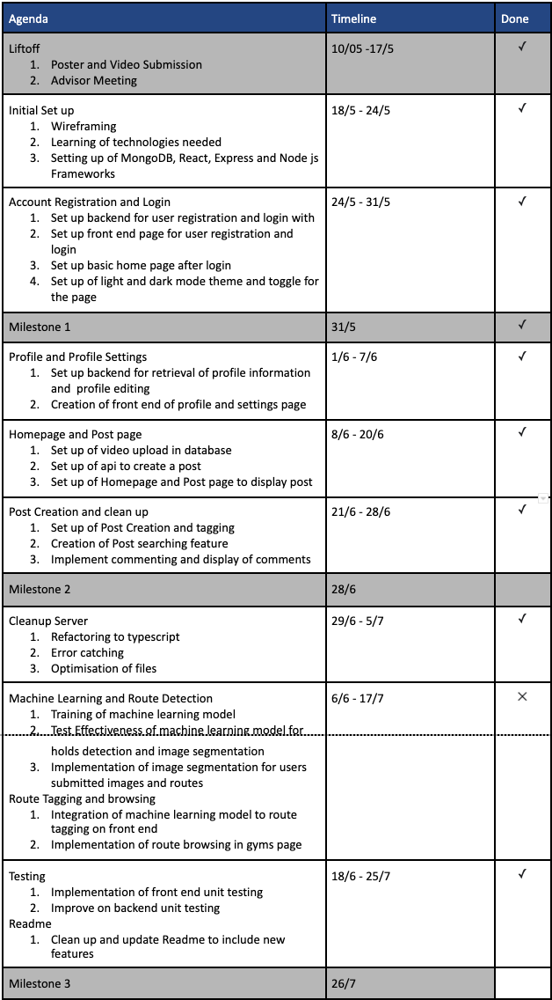
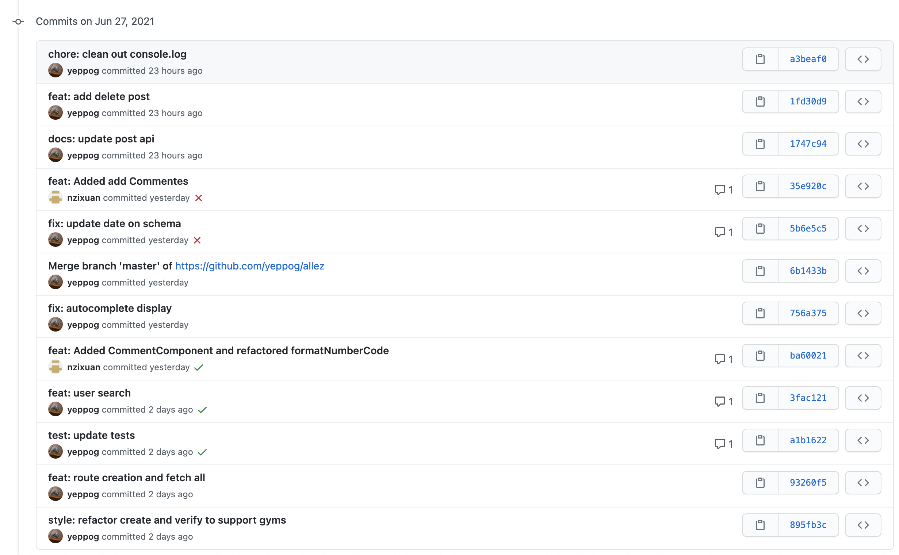
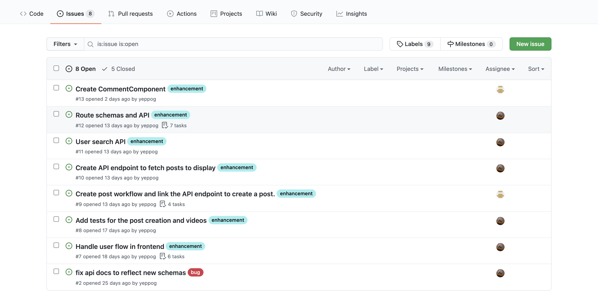
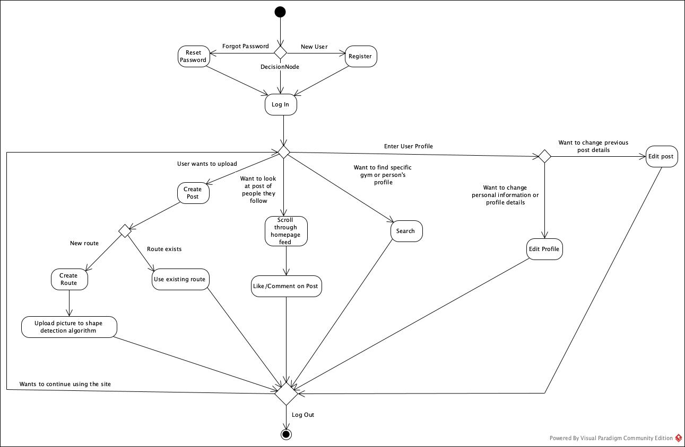

# Allez - Orbital 2021

Proposed Level of Achievement: Apollo 11

## Motivation

Imagine you&#39;re stuck on a route while climbing and you are not sure how to proceed. Nobody around you knows how to do it either. You want to have someone show you how to do the route i.e show you the beta (guide for the movement sequence to get through the problems) but you can&#39;t find the any videos online.

There are indeed many climbing Instagram pages online that have climbers post videos of them climbing the route and they may have the beta that you are looking for, but it is messy, unorganised, and often hard to find especially if you don&#39;t follow these pages. To solve this, **Allez** eliminates the hassle of looking through Instagram tirelessly, through building a social media beta-sharing platform solely for the purpose of rock climbing sharing.

## Aim

We hope to be able to categorise routes and betas efficiently such that users are able to search for them quickly. We also hope to allow climbing gyms to have a special account such that they can manage their routes, as well as upload the intended beta (solution).

## User Stories

1. As a climber who is stuck on a route, I would be able to quickly look up the solution of the current route that I am on efficiently.
2. As a professional climber who knows how to solve this route, I would be able to upload and share videos of me completing the route to help others.
3. As an owner of a rock climbing gym, I would be able to publish my route rotations for the week, as well as upload the intended betas for routes so my customers have a guide of how to do the problem.
4. As a user of any sort, I would be able to share and discuss solutions to these routes on the platform and interact with other users.
5. As a user of any sort, I want to be able to post my thoughts and feed where others in my network can comment on.
6. As a user of any sort, I want to be able to follow and receive updates on people/gyms that I am interested in hearing from.
7. As a user of any sort, I want to be able to easily upload a climbing route to share with people.

## Features and Timeline

We aim to create a **web-based social media site** which provides a place for climbers to share their betas (solutions) to climbing problems for climbers to see and learn.

This acts as a customised and targeted social media platform that climbers can use to quickly search up solutions and share their own personal solutions.

Gyms can submit their own routes and there can be community submitted routes as well.

When creating routes, users submit an image of the route which is processed our backend which will be trained by machine learning to allow users to select and label the holds (start, end, footholds, etc). This makes it much easier for a user to submit a route.

Users will be able look through posts sorted by the routes that they are interested in and submit their betas under a route or create their own.

Example of how a wall might be segmented to allow users to select their routes.
Source: Stōkt https://www.getstokt.com/

## Deployment

The project can be accessed from the following links

Frontend: <https://allez-orbital.netlify.app/>

Backend: <https://allez-orbital.herokuapp.com/>

**Features:**

1. **Account Registration and Log in**
    - Users can register their account with their details and log in to the website

2. **Homepage Feed of following posts**
  - Feed of posts of climbers or gyms that the user follows which will constantly be updated when someone followed posted a new post    

3. **Posting of Video or Photos**
    - Users can share videos or photos of them attempting and completing climbing routes

4. **Post-editing and Deletion**
    - Users can edit and delete posts that the user have created.

5. **Profile editing**
    - Users can edit key information on the user's profile such as their profile picture, bio, username and password

6. **Searching for Users, Gyms, Routes**
    - Users can find User and Gym pages, and browse routes based on tags
    - Users can view posts of other users and posts that are tagged to a gym

**To be completed by Milestone 3:**

**Features**

1. **Machine learning to identify route holds for easier route creation**
  - Use of machine learning for climbing holds recognisation and segmentation
  - Use of segemented image for users to select holds that are included in their route

2. **Route tagging**
  - Ability for users to browse through route and videos tagged to the routes

**Optimisation**

1. **Cleaning up of Backend**
  - Refactoring to Typescript for addition type safety
  - Error Catching to handle erroneous inputs
  - Abstracting duplicate functions

2. **Optimise file size to be held on server**
  - Compression of media uploaded to reduce space on server

**Testing**

1. **Frontend Testing**
  - Unit testing for conditional rendering and error handling
  - Testing mock inputs and expected outputs
2. **Backend Testing**
  - Addtion of more tests to increase code coverage

**Timeline**

## **Software Engineering Practises**

**Project Management with Notion**

Notion is used as it as our one stop location for any information related to the project besides that it also helps us see the work we have currently to do and allocate it to various people to be completed.

**Version Control with Git**

Git is used as the version control of choice with Github as the hosting site.

In addition to committing our changes to github we also use the github issues page to keep track of enhancements and bugs that our project has.

## Class Diagram

## Activity Diagram

## Getting Started

1. Clone this repository by running `git clone`.

2. `cd` into `client` and `server` and run the command `npm start`.
